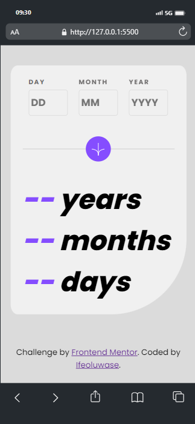
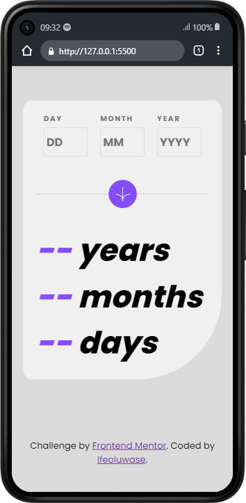
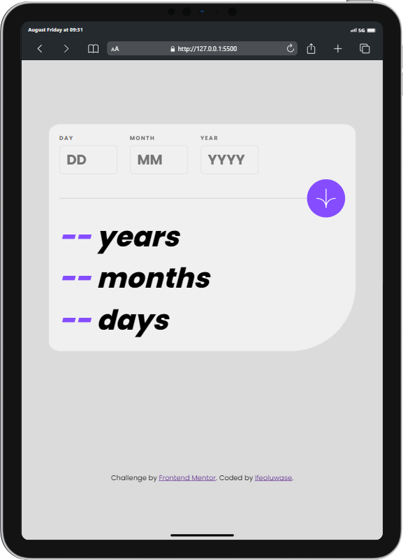

# Frontend Mentor - Age calculator app solution

This is a solution to the [Age calculator app challenge on Frontend Mentor](https://www.frontendmentor.io/challenges/age-calculator-app-dF9DFFpj-Q). Frontend Mentor challenges help you improve your coding skills by building realistic projects. 

## Table of contents

- [Overview](#overview)
  - [The challenge](#the-challenge)
  - [Screenshot](#screenshot)
  - [Links](#links)
  - [Built with](#built-with)
  - [What I learned](#what-i-learned)
  - [Continued development](#continued-development)
- [Author](#author)
- [Acknowledgments](#acknowledgments)

**Note: Delete this note and update the table of contents based on what sections you keep.**

## Overview

### The challenge

Users should be able to:

- View an age in years, months, and days after submitting a valid date through the form
- Receive validation errors if:
  - Any field is empty when the form is submitted
  - The day number is not between 1-31
  - The month number is not between 1-12
  - The year is in the future
  - The date is invalid e.g. 31/04/1991 (there are 30 days in April)
- View the optimal layout for the interface depending on their device's screen size
- See hover and focus states for all interactive elements on the page
- **Bonus**: See the age numbers animate to their final number when the form is submitted

### Screenshots

### Links

- Solution URL: [https://github.com/TeeHigh/Age-Calculator](https://github.com/TeeHigh/Age-Calculator)
- Live Site URL: [Age-Calculator](https://teehigh.github.io/Age-Calculator)

### Built with

- Semantic HTML5 markup
- CSS custom properties
- Flexbox
- CSS Grid
- [SASS](https://sass-lang.com/) - SASS (CSS Preprocessor)

**Note: These are just examples. Delete this note and replace the list above with your own choices**

### What I learned

I learnt how to work with the date object in Javascript and input validation.

### Continued development

I want to refine my knowledge on Javascript objects and the understand validation indepth.

## Author

- Website - [Ifeoluwase Taiwo](https://github.com/TeeHigh)
- Frontend Mentor - [@TeeHigh](https://www.frontendmentor.io/profile/TeeHigh)
- Twitter - [@Tee__High](https://www.twitter.com/Tee__High)

## Acknowledgments

Help with getting date object - (https://www.youtube.com/watch?v=z_6aUavlRKI&t=2107s)
